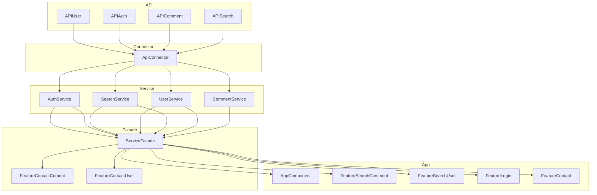

```mermaid
graph TD;


    subgraph App;
      AppComponent
      FeatureSearchComment
      FeatureSearchUser
      FeatureLogin
      FeatureContact
    end;

    subgraph Facade;
      ServiceFacade-->FeatureLogin;
      ServiceFacade-->AppComponent;
      ServiceFacade-->FeatureSearchComment;
      ServiceFacade-->FeatureContactComent;
      ServiceFacade-->FeatureSearchUser;
      ServiceFacade-->FeatureContactUser;
      ServiceFacade-->FeatureContact;
    end;


    subgraph Service;
      AuthService-->ServiceFacade;
      AuthService-->ServiceFacade;
      SearchService-->ServiceFacade;
      UserService-->ServiceFacade;
      SearchService-->ServiceFacade;
      UserService-->ServiceFacade;
      CommentService-->ServiceFacade;
    end;


    subgraph Connector;
      ApiConnector-->UserService
      ApiConnector-->AuthService
      ApiConnector-->CommentService
      ApiConnector-->SearchService
    end;

    subgraph API;
      APIUser-->ApiConnector
      APIAuth-->ApiConnector
      APIComment-->ApiConnector
      APISearch-->ApiConnector
    end;

```
